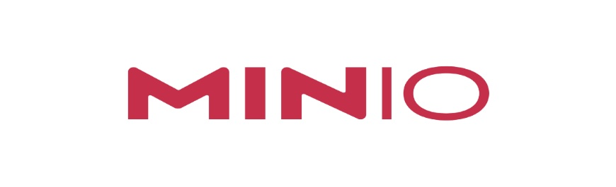

# Minio Deploy Labs

These labs are intended to be used with the MinIO Lab Terraform deployment and will provide users with instruction on how to deploy MinIO using the Native server, Docker, Docker-Compose and Kubernetes Operator.

---

## IMPORTANT NOTICE
You will incur some cost as a result of deploying this to your cloud provider. MinIO is not responsible for those costs.

Deployments are provided "AS-IS" with no guarantee on availability or complete functionality. These will be tested regularly, but ultimately you are responsible for deploying / maintaining / tearing down these systems. These are not intended to be production grade deployments, but rather examples and training resources to skill up your knowledge on using and deploying MinIO.

---

## Deploying Minio on the MinIO Lab Server

Click the links below to navigate to the desired deployment method.

- [Native (Systemd)](deploying/native-systemd/README.md)
- [Docker-CLI](deploying/docker-cli/README.md)
- [Docker-Compose](deploying/docker-compose/README.md)
- [Kubernetes Operator](deploying/kubernetes-operator/README.md)

---

## About Minio

MinIO offers high-performance, S3 compatible object storage.
Native to Kubernetes, MinIO is the only object storage suite available on every public cloud, every Kubernetes distribution, the private cloud and the edge. MinIO is software-defined and is 100% open source under GNU AGPL v3.

- **Website:** https://min.io/
- **Official Github:** https://github.com/minio